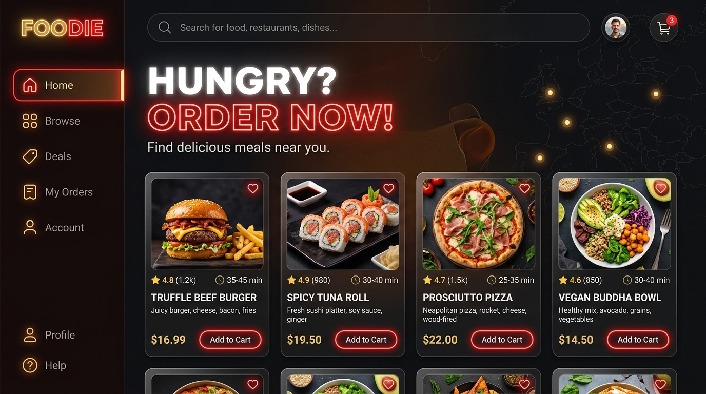
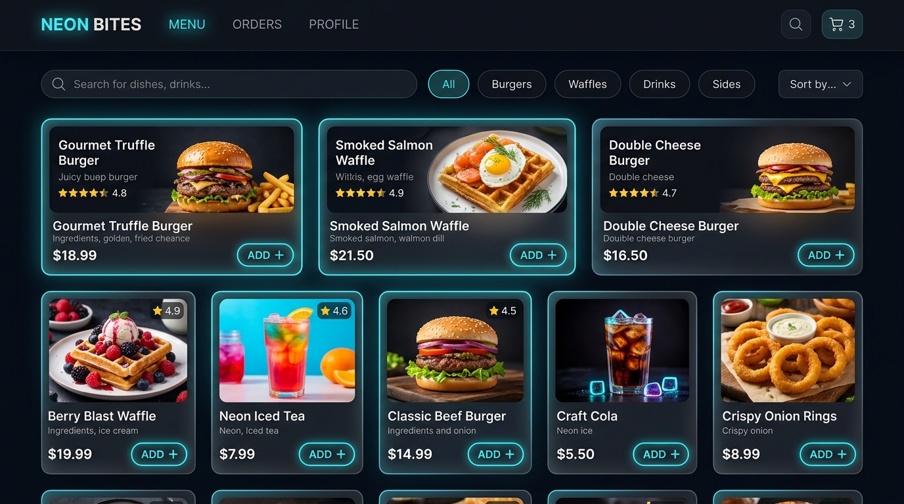
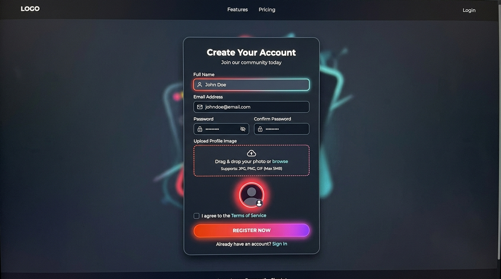
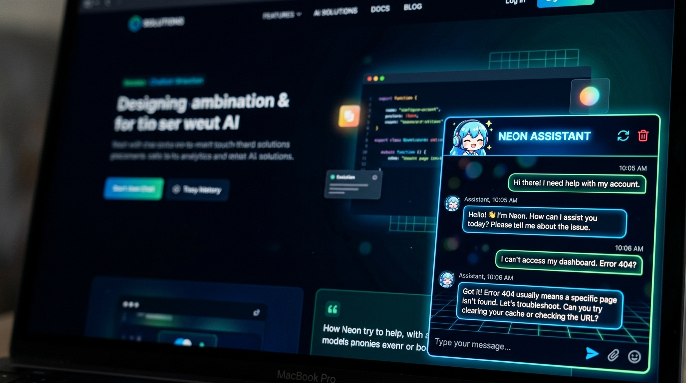

# Foodie - Ultimate Food Delivery App Clone 🍕🍔

Foodie is a feature-rich, high-performance, dark-themed food ordering web application built using the MERN stack (React, Node, Express, MongoDB). It features a sleek glassmorphic UI, smooth Framer Motion animations, a simulated 3D Chef model, custom user avatar file uploads, and a highly resilient architecture.

---

## 📸 App Screenshots

### 🏠 Landing Page


### 🍔 Interactive Food Gallery


### 👤 Profile Image Registration


### 🤖 Cute Anime Chatbot Support


---

## 🌟 Key Features

1. **Vibrant Glassmorphic UI**: High-fidelity dark mode styling with neon highlights, custom Google Fonts, and spring animations.
2. **Interactive 3D Chef**: Canvas-rendered 3D Chef model in the navigation panel that reacts to mouse hovers.
3. **End-to-End User Profiles**: Register with actual image file uploads (converted to Base64) that persist to MongoDB Atlas and reflect in the sidebar, checkout screens, orders, and reviews.
4. **Auto-Sliding Reviews Carousel**: Submit reviews with custom or preset food images, which immediately populate and slide in a custom auto-scrolling timeline.
5. **Private Orders & Reordering**: Timelines and cancelable orders list gated exclusively to the sidebar menu. Supports re-ordering directly in one click.
6. **Robust Checkout & Payments**: High-fidelity simulated Razorpay checkout portal with card/UPI options, mobile auto-zoom prevention, and banking secure OTP verification.
7. **Local DB Fallback System**: Automatically switches to a local JSON file database (`backend/data_db.json`) if MongoDB Atlas whitelisting or connection drops, maintaining 100% app uptime.
8. **Interactive Anime Chatbot**: Chibi anime avatar floating support widget with conversation history clear controls.

---

## 🛠️ Tech Stack

- **Frontend**: React.js, Tailwind CSS (Vanilla styled), Framer Motion, Three.js / React Three Fiber, React Icons.
- **Backend**: Node.js, Express.js, JWT Authentication, Bcryptjs.
- **Database**: MongoDB Atlas (Primary) & Local JSON Database (Resilient Fallback).

---

## 🚀 Local Installation & Setup

### Prerequisites
- Node.js installed on your system.

### 1. Setup the Backend
1. Navigate to the backend directory:
   ```bash
   cd backend
   ```
2. Install dependencies:
   ```bash
   npm install
   ```
3. Configure your environmental variables inside a `.env` file:
   ```env
   PORT=5000
   MONGO_URI=your_mongodb_connection_string
   JWT_SECRET=your_secret_key
   ```
4. Start the development server:
   ```bash
   npm run dev
   ```

### 2. Setup the Frontend
1. Navigate to the frontend directory:
   ```bash
   cd frontend
   ```
2. Install dependencies:
   ```bash
   npm install
   ```
3. Start the React development server:
   ```bash
   npm start
   ```
4. Open [http://localhost:3000](http://localhost:3000) in your browser.

---

## 📱 Local Network Testing (Mobile/Tablet)

The app dynamically resolves the backend URL to match the current browser location (`window.location.hostname`), allowing testing on local devices under the same Wi-Fi connection:

1. Open your browser on your device and navigate to your host PC's local IP address:
   `http://10.152.25.192:3000`
2. **If connection fails**, ensure port 5000 is open in your host PC's firewall:
   - Run Windows PowerShell as Administrator and execute:
     ```powershell
     New-NetFirewallRule -Name "AllowNodeAPI" -DisplayName "Allow Node API Port 5000" -Direction Inbound -Action Allow -Protocol TCP -LocalPort 5000
     ```

---

## ☁️ Deployment Guide

### Frontend (Vercel)
1. Import your GitHub repository into Vercel.
2. Configure the **Root Directory** setting to `frontend`.
3. Click **Deploy**.

### Backend (Render / Railway)
1. Create a Web Service and set the **Root Directory** to `backend`.
2. Configure your environmental variables (`MONGO_URI`, `JWT_SECRET`).
3. Set build command to `npm install` and start command to `node server.js`.

---

## 👩‍💻 Developer Info

**Benazir Zoya**
- **Portfolio**: [portfolio-rho-tan-16.vercel.app](https://portfolio-rho-tan-16.vercel.app)
- **GitHub**: [@benazirzoya](https://github.com/benazirzoya)
- **LinkedIn**: [Benazir Banu](https://www.linkedin.com/in/benazir-banu)
- **Instagram**: [@benazir1822](https://www.instagram.com/benazir1822)
- **Twitter/X**: [@benriq18](https://twitter.com/benriq18)
- **Email**: [benriq18@gmail.com](mailto:benriq18@gmail.com)
